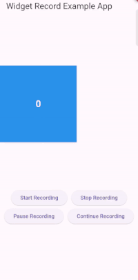

---

# widget_record_video 🎥

A Flutter plugin to record the content of a specific widget on the screen as a video. This plugin uses `flutter_quick_video_encoder` to encode video from frames captured within the widget, allowing for high-quality video recording within Flutter apps.

This plugin uses ffmpeg to handle part of the process, so when you build the apk, the application capacity will be large but rest assured that it will not be a problem when you upload it to the store.


## Features

- **Customizable Screen Recording**: Capture the content of any widget within your app.
- **Recording Time Limit**: Set a maximum recording duration to control video length.
- **Recording Control**: Start and stop recording at any point.
- **Completion Callback**: Get the video file path upon recording completion.




## Installation

Add `widget_record_video` to your `pubspec.yaml` file:

```yaml
dependencies:
  widget_record_video: ^0.0.3
```

## Usage

### Initial Setup of `RecordingWidget`

`RecordingWidget` is the main widget that will record the screen content of a specified widget. Here's how to set it up:

```dart

  final RecordingController _recordingController = RecordingController();
  _recordingController.start?.call();
  _recordingController.stop?.call();
  _recordingController.pauseRecord?.call();
  _recordingController.coninueRecord?.call();


  RecordingWidget(
    controller: _recordingController,
    limitTime: 120, // Maximum recording time in seconds
    onComplete: (filePath) {
      print("Video saved at: $filePath");
    },
    child: Container(
      color: Colors.blue,
      width: 200,
      height: 200,
        child: Center(child: Text("Recording Area")),
      ),
  ),

```

### Key Components

#### `RecordingWidget`

This widget encapsulates the content you want to record.

- **`child`**: The widget to be recorded.
- **`outputPath`**: Custom save location as desired.
- **`controller`**: An instance of `RecordingController` that manages recording actions.
- **`limitTime`**: Sets the maximum recording time in seconds. For unlimited recording, set this to `-1`.
- **`onComplete`**: Callback triggered after recording ends, providing the file path to the saved video.

#### `RecordingController`

The controller allows you to start and stop recording via these functions:

- **`start`**: A function to initiate recording.
- **`stop`**: A function to terminate recording.
- **`pauseRecord`**: A function to pause the recording process.
- **`continue`**: A function to continue the recording process
## Important Notes

- This plugin leverages `flutter_quick_video_encoder` for encoding; ensure your app has appropriate permissions for file storage.
- For optimal performance, make sure the widget being recorded has a fixed size, as resizing can lead to recording issues.

## Contributing

We welcome contributions! If you find bugs or have feature requests, please open an Issue. Pull Requests are also welcome.

## License

This project is licensed under the MIT License. See the LICENSE file for details.

---

This README provides a clean and informative guide on using `widget_record_video`, making it straightforward to integrate and start recording content within any Flutter application.